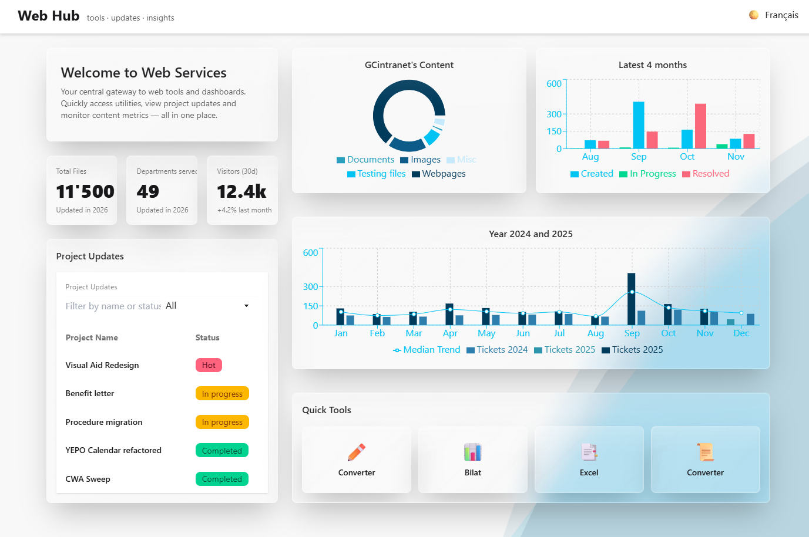
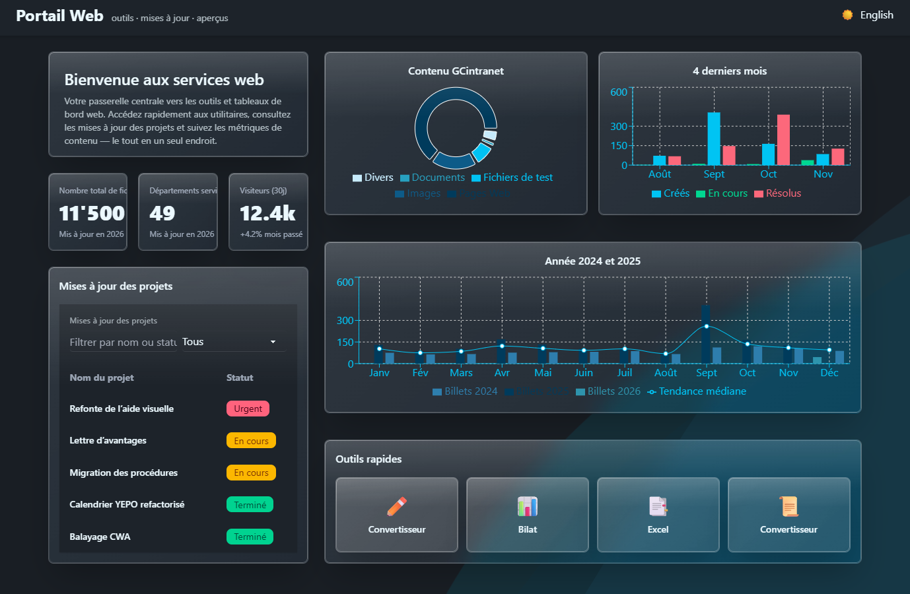

# Web Team Hub

**Web Team Hub** is a TypeScript-based dashboard built with **DaisyUI** that provides an overview of the web team’s performance, statistics, and tools. It centralizes key information and resources in a clean, interactive interface.  


## Features

- **Team Statistics**: Visualize team activity, contributions, and project metrics.  
- **Tools & Utilities**: Access the suite of internal tools created by the team.  
- **Interactive UI**: Built with **DaisyUI** for a modern, responsive interface.  
- **TypeScript Powered**: Strongly typed codebase for maintainability and reliability.  

## Installation

```console

git clone <repository-url>
cd web-team-hub
npm install
npm run dev

```
## Usage
- Launch the development server:
```console

npm run dev

```

- Open http://localhost:3000 in your browser.

- Explore team statistics and access the tools created by the web team.

## Tech Stack

- TypeScript
- React
- DaisyUI / Tailwind CSS
- recharts - http://recharts.github.io/
- i18n - https://www.i18next.com/

 

